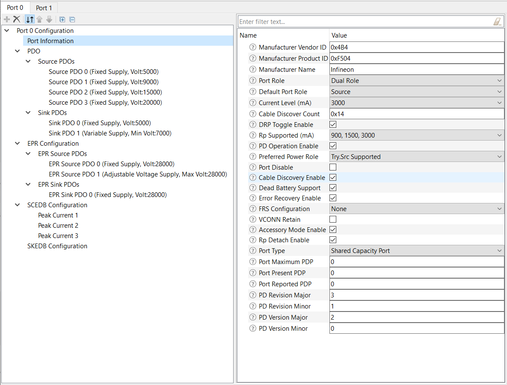
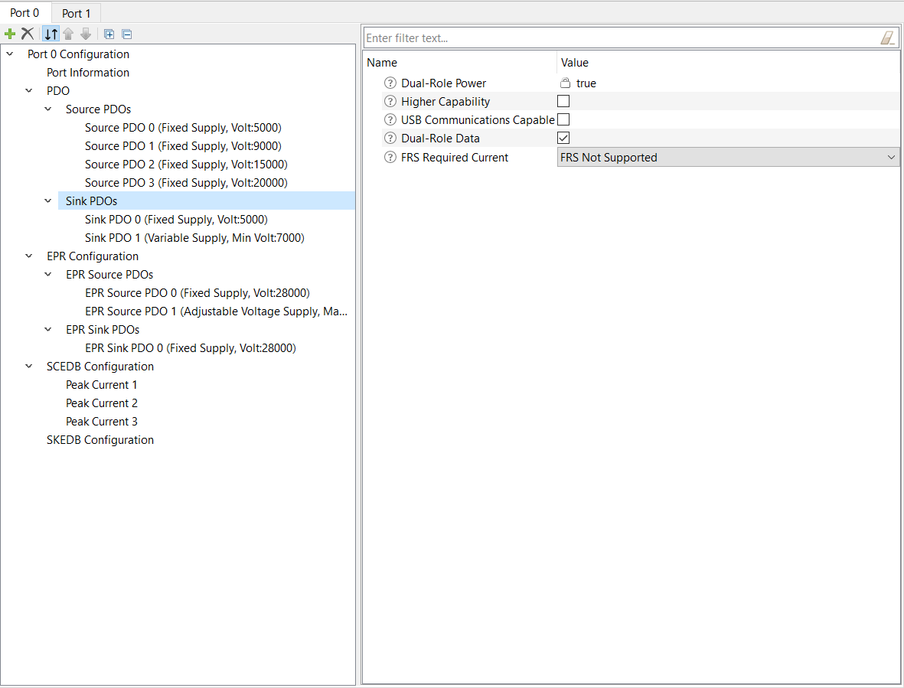
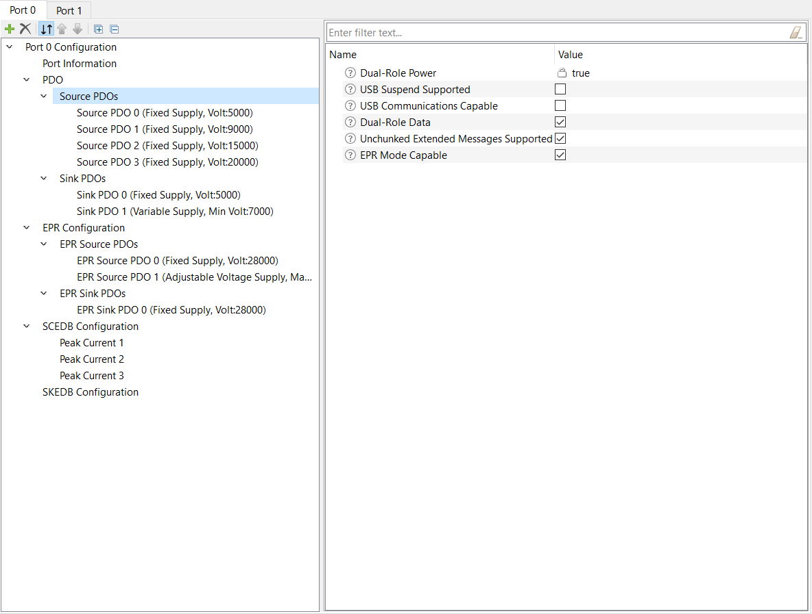
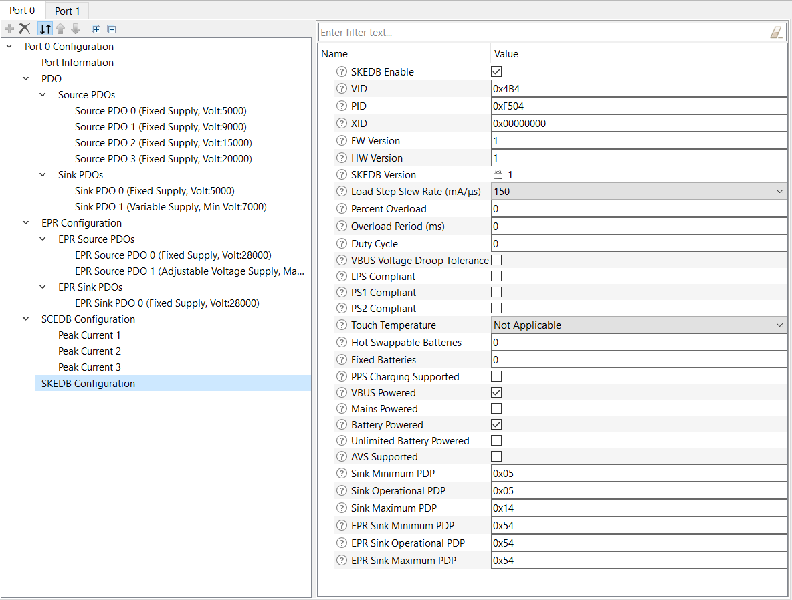

# EZ-PD&trade; PMG1 MCU: USB PD DRP Extended Power Range

This code example demonstrates USB-C attach detection and USB Power Delivery contract negotiation using EZ-PD&trade; PMG1 MCU devices in the DRP role and supports Extended Power Range (EPR) operation.

[View this README on GitHub.](https://github.com/Infineon/mtb-example-pmg1-usbpd-drp-epr)

[Provide feedback on this code example.](https://cypress.co1.qualtrics.com/jfe/form/SV_1NTns53sK2yiljn?Q_EED=eyJVbmlxdWUgRG9jIElkIjoiQ0UyMzY1ODIiLCJTcGVjIE51bWJlciI6IjAwMi0zNjU4MiIsIkRvYyBUaXRsZSI6IkVaLVBEJnRyYWRlOyBQTUcxIE1DVTogVVNCIFBEIERSUCBFeHRlbmRlZCBQb3dlciBSYW5nZSIsInJpZCI6InZuYWwiLCJEb2MgdmVyc2lvbiI6IjEuMS4wIiwiRG9jIExhbmd1YWdlIjoiRW5nbGlzaCIsIkRvYyBEaXZpc2lvbiI6Ik1DRCIsIkRvYyBCVSI6IldJUkVEIiwiRG9jIEZhbWlseSI6IlRZUEUtQyJ9)

## Requirements

- [ModusToolbox&trade; software](https://www.infineon.com/modustoolbox) v3.0 or later (tested with v3.0)
- Board support package (BSP) minimum required version: 3.0.0
- Programming language: C
- Associated parts: [EZ-PD&trade; PMG1S3 MCU](https://www.infineon.com/PMG1)


## Supported toolchains (make variable 'TOOLCHAIN')

- GNU Arm® Embedded Compiler v10.3.1 (`GCC_ARM`) – Default value of `TOOLCHAIN`
- Arm&reg; Compiler v6.16 (`ARM`)
- IAR C/C++ Compiler v9.30.1 (`IAR`)


## Supported hardware

This code example is developed to work with the PMG1-S3 devices.

  **Note:** See [AN235644 – USB PD DRP (Dual-Role Power) schematics using EZ-PD&trade; PMG1 MCUs](https://www.infineon.com/dgdl/Infineon-USB_PD_DRP_dual-role_power_schematics_using_EZ-PD_PMG1_MCUs-ApplicationNotes-v02_00-EN.pdf?fileId=8ac78c8c83cd30810183ea6518841d1e) for more details.


## Hardware setup

1. Setup the hardware with MCU connections according to the USB PD DRP reference schematics mentioned in section supported hardware section above

2. Ensure that the connections from PMG1 MCU to USB PD source power regulator are according to following table

   **Table. GPIO connections from PMG1-S3 device for DRP operation**

   | PMG1-S3 | External device  | Description |
   | ------------------- | ------------------ | ------------------ |
   | P2.2 | I2C_SDA of power regulator | To control the power regulator output |
   | P2.3 | I2C_SCL of power regulator | To control the power regulator output |
   | P2.1 | PFET gate control | To control the PFET load switch in consumer path |
   
   The PMG1-S3 DRP design reference schematic design uses the MP4247 buck-boost DC/DC converter from Monolithic Power Systems as a variable output VBUS source. The  voltage output of the regulator can be controlled using I2C interface.

3. Provide the 24V 5A power to power up the board in source mode

4. Use SWD programming header for flashing the MCU


## Software setup

This example requires no additional software or tools.


## Using the code example

Create the project and open it using one of the following:

<details><summary><b>In Eclipse IDE for ModusToolbox&trade; software</b></summary>

1. Click the **New Application** link in the **Quick Panel** (or, use **File** > **New** > **ModusToolbox&trade; Application**). This launches the [Project Creator](https://www.infineon.com/ModusToolboxProjectCreator) tool.

2. Pick a kit supported by the code example from the list shown in the **Project Creator - Choose Board Support Package (BSP)** dialog.

   When you select a supported kit, the example is reconfigured automatically to work with the kit. To work with a different supported kit later, use the [Library Manager](https://www.infineon.com/ModusToolboxLibraryManager) to choose the BSP for the supported kit. You can use the Library Manager to select or update the BSP and firmware libraries used in this application. To access the Library Manager, click the link from the **Quick Panel**.

   You can also just start the application creation process again and select a different kit.

   If you want to use the application for a kit not listed here, you may need to update the source files. If the kit does not have the required resources, the application may not work.

3. In the **Project Creator - Select Application** dialog, choose the example by enabling the checkbox.

4. (Optional) Change the suggested **New Application Name**.

5. The **Application(s) Root Path** defaults to the Eclipse workspace which is usually the desired location for the application. If you want to store the application in a different location, you can change the *Application(s) Root Path* value. Applications that share libraries should be in the same root path.

6. Click **Create** to complete the application creation process.

For more details, see the [Eclipse IDE for ModusToolbox&trade; software user guide](https://www.infineon.com/MTBEclipseIDEUserGuide) (locally available at *{ModusToolbox&trade; software install directory}/docs_{version}/mt_ide_user_guide.pdf*).

</details>

<details><summary><b>In command-line interface (CLI)</b></summary>

ModusToolbox&trade; software provides the Project Creator as both a GUI tool and the command line tool, "project-creator-cli". The CLI tool can be used to create applications from a CLI terminal or from within batch files or shell scripts. This tool is available in the *{ModusToolbox&trade; software install directory}/tools_{version}/project-creator/* directory.

Use a CLI terminal to invoke the "project-creator-cli" tool. On Windows, use the command line "modus-shell" program provided in the ModusToolbox&trade; software installation instead of a standard Windows command-line application. This shell provides access to all ModusToolbox&trade; software tools. You can access it by typing `modus-shell` in the search box in the Windows menu. In Linux and macOS, you can use any terminal application.

The "project-creator-cli" tool has the following arguments:

Argument | Description | Required/optional
---------|-------------|-----------
`--board-id` | Defined in the `<id>` field of the [BSP](https://github.com/Infineon?q=bsp-manifest&type=&language=&sort=) manifest | Required
`--app-id`   | Defined in the `<id>` field of the [CE](https://github.com/Infineon?q=ce-manifest&type=&language=&sort=) manifest | Required
`--target-dir`| Specify the directory in which the application is to be created if you prefer not to use the default current working directory | Optional
`--user-app-name`| Specify the name of the application if you prefer to have a name other than the example's default name | Optional

<br />

The following example clones the "[USB PD DRP EPR](https://github.com/Infineon/mtb-example-pmg1-usbpd-drp-epr)" application with the desired name "UsbPdDrpEpr" configured for the *PMG1S3DUAL* BSP into the specified working directory, *C:/mtb_projects*:

   ```
   project-creator-cli --board-id PMG1S3DUAL --app-id mtb-example-pmg1-usbpd-drp-epr --user-app-name UsbPdDrpEpr --target-dir "C:/mtb_projects"
   ```

**Note:** The project-creator-cli tool uses the `git clone` and `make getlibs` commands to fetch the repository and import the required libraries. For details, see the "Project creator tools" section of the [ModusToolbox&trade; software user guide](https://www.infineon.com/ModusToolboxUserGuide) (locally available at *{ModusToolbox&trade; software install directory}/docs_{version}/mtb_user_guide.pdf*).

To work with a different supported kit later, use the [Library Manager](https://www.infineon.com/ModusToolboxLibraryManager) to choose the BSP for the supported kit. You can invoke the Library Manager GUI tool from the terminal using `make library-manager` command or use the Library Manager CLI tool "library-manager-cli" to change the BSP.

The "library-manager-cli" tool has the following arguments:

Argument | Description | Required/optional
---------|-------------|-----------
`--add-bsp-name` | Name of the BSP that should be added to the application | Required
`--set-active-bsp` | Name of the BSP that should be as active BSP for the application | Required
`--add-bsp-version`| Specify the version of the BSP that should be added to the application if you do not wish to use the latest from manifest | Optional
`--add-bsp-location`| Specify the location of the BSP (local/shared) if you prefer to add the BSP in a shared path | Optional

<br />

Following example adds the PMG1S3DUAL BSP to the already created application and makes it the active BSP for the app:

   ```
   library-manager-cli --project "C:/mtb_projects/UsbPdDrpEpr" --add-bsp-name PMG1S3DUAL --add-bsp-version "latest-v3.X" --add-bsp-location "local"

   library-manager-cli --project "C:/mtb_projects/UsbPdDrpEpr" --set-active-bsp APP_PMG1S3DUAL
   ```

</details>

<details><summary><b>In third-party IDEs</b></summary>

Use one of the following options:

- **Use the standalone [Project Creator](https://www.infineon.com/ModusToolboxProjectCreator) tool:**

   1. Launch Project Creator from the Windows Start menu or from *{ModusToolbox&trade; software install directory}/tools_{version}/project-creator/project-creator.exe*.

   2. In the initial **Choose Board Support Package** screen, select the BSP, and click **Next**.

   3. In the **Select Application** screen, select the appropriate IDE from the **Target IDE** drop-down menu.

   4. Click **Create** and follow the instructions printed in the bottom pane to import or open the exported project in the respective IDE.

<br />

- **Use command-line interface (CLI):**

   1. Follow the instructions from the **In command-line interface (CLI)** section to create the application.

   2. Export the application to a supported IDE using the `make <ide>` command.

   3. Follow the instructions displayed in the terminal to create or import the application as an IDE project.

For a list of supported IDEs and more details, see the "Exporting to IDEs" section of the [ModusToolbox&trade; software user guide](https://www.infineon.com/ModusToolboxUserGuide) (locally available at *{ModusToolbox&trade; software install directory}/docs_{version}/mtb_user_guide.pdf*).

</details>

## Operation

1. Ensure that the steps listed in the [Hardware setup](#hardware-setup) section are completed.

2. Program the board using one of the following:

   <details><summary><b>Using Eclipse IDE for ModusToolbox&trade; software</b></summary>

      i. Select the application project in the Project Explorer.

      ii. In the **Quick Panel**, scroll down, and click **\<Application Name> Program (KitProg3_MiniProg4)**.
   </details>

   <details><summary><b>Using CLI</b></summary>

     From the terminal, execute the `make program` command to build and program the application using the default toolchain to the default target. The default toolchain and target are specified in the application's Makefile but you can override those values manually:
      ```
      make program TOOLCHAIN=<toolchain>
      ```

      Example:
      ```
      make program TOOLCHAIN=GCC_ARM
      ```
   </details>

3. Connect a PD Sink device and EZ-PD&trade; Protocol Analyzer on Port 0 of the baseboard. PD contract can be observed on the Protocol Analyzer.


## Debugging

You can debug the example to step through the code. In the IDE, use the **\<Application Name> Debug (KitProg3_MiniProg4)** configuration in the **Quick Panel**. Ensure that the board is connected to your PC using the USB cable through the MiniProg4. See the "Debug mode" section in the kit user guide.

For more details, see the "Program and debug" section in the [Eclipse IDE for ModusToolbox&trade; software user guide](https://www.infineon.com/MTBEclipseIDEUserGuide).


## Design and implementation

PMG1 MCU devices support a USBPD block that integrates Type-C terminations, comparators, and the Power Delivery transceiver required to detect the attachment of a partner device and negotiate power contracts with it.

On reset, the USBPD block is initialized with the following settings:

   - The receiver clock input of the block is connected to a 12-MHz PERI-derived clock.

   - The transmitter clock input of the block is connected to a 600-kHz PERI-derived clock.

   - The SAR ADC clock input of the block is connected to a 1-MHz PERI-derived clock.

   - The SAR ADC in the USBPD block is configured to measure the VBUS_TYPE-C voltage through an internal divider.

This application uses the PDStack middleware library in a DRP role.

**Figure 1. Firmware flowchart**


<br>

The PDStack middleware library configures the USBPD block on the PMG1 MCU device to detect Type-C connection state changes and USB PD messages, and notify the stack through callback functions. The callback function registers the pending tasks, which are then handled by PDStack through the `Cy_PdStack_Dpm_Task` function. This function is expected to be called at appropriate times from the main processing loop of the application.

**Figure 2. PDStack task flowchart**


<br>

The PDStack middleware library implements the state machines defined in the [USB Type-C Cable and Connector](https://www.usb.org/document-library/usb-type-cr-cable-and-connector-specification-revision-20) and the [USB Power Delivery](https://www.usb.org/document-library/usb-power-delivery) specifications. PDStack consists of the following main modules:

- **Type-C Manager:** Responsible for detecting a Type-C connection and identifying the type of connection. It uses the configurable Rp/Rd terminations provided by the USBPD block and the internal line state comparators. The Type-C Manager implements the state machines defined in the USB Type-C Cable and Connector specification and provides the following functionality:

    - *Manage CC terminations*: Applies Rp/Rd terminations according to the port role

    - *Attach detection*: Performs the required debounce and determines the type of device attached

    - *Detach detection*: Monitors the CC line and VBus for detecting a device detach

- **Protocol Layer:** Forms the messages used to communicate between a pair of ports/cable plugs. It is responsible for forming capabilities messages, requests, responses, and acknowledgements. It receives inputs from the Policy Engine indicating which messages to send and relays the responses back to the policy engine.

- **Policy Engine:** Provides a mechanism to monitor and control the USB Power Delivery system within a particular consumer, provider, or cable plug. It implements the state machines defined in the *USB Power Delivery* specification and contains implementations of all PD Atomic Message Sequences (AMS). It interfaces with the protocol layer for PD message transmission/reception for controlling the reception of message types according to conditions such as the current state of the port. It also interfaces with the Type-C Manager for error conditions like Type-C error recovery.

- **Device Policy Manager (DPM):** Provides an interface to the application layer to initialize, monitor, and configure the PDStack middleware operation. The DPM provides the following functionality:

    - Initializes the Policy Engine and Type-C Manager

    - Starts the Type-C state machine followed by the Policy Engine state machine

    - Stops and disables the Type-C port

    - Allows entry/exit from deep sleep to achieve low power based on the port status

    - Provides APIs for the application to send PD/Type-C commands

    - Provides event callbacks to the application for application-specific handling

The PDStack library uses a set of callbacks registered by the application to perform board-specific tasks such as turning the consumer/provider power path ON/OFF and identifying the optimal source power profile to be used for charging. In this example, these functions are implemented using the appropriate APIs provided as part of the Peripheral Driver Library (PDL).

The stack also provides notification of various connection and PD policy state changes so that the rest of the system can be configured as required.

The application tries to keep the PMG1 MCU device in deep sleep, where all clocks are disabled and only limited hardware blocks are enabled, for most of its working time. Interrupts in the USBPD block are configured to detect any changes that happen while the device is in sleep, and wake it up for further processing.

An overvoltage (OV) comparator in the USBPD block is used to detect cases where the power source is supplying incorrect voltage levels and automatically shut down the power switches to protect the rest of the components on the board.

### Compile-time configurations

The PMG1 MCU USB PD DRP application functionality can be customized through a set of compile-time parameters that can be turned ON/OFF through the *config.h* and *Makefile* file.

| Macro name          | Description                           | Allowed values |
| :------------------ | :------------------------------------ | :------------- |
| `CY_PD_SINK_ONLY`     | Specifies that the application supports only the USB PD sink (consumer) role | Set to 0u |
| `CY_PD_SOURCE_ONLY`   | Specifies that the application supports only the USB PD source (provider) role | Set to 0u |
| `NO_OF_TYPEC_PORTS`   | Specifies the number of USB-C ports supported | Set to 2u |
| `CY_PD_REV3_ENABLE`   | Enables USB PD Revision 3.1 support | 1u or 0u |
| `CY_PD_CBL_DISC_DISABLE` | Disables cable discovery | 0u |
| `CY_PD_EPR_ENABLE`    | Enables EPR support | 1u or 0u |
| `CY_PD_EPR_AVS_ENABLE` | Enables EPR AVS support | 1u or 0u|
| `MPS_28V_REG_ENABLE` | Enables MPS PD regulator | Set to 1u for EPR operation |
| `VBUS_OVP_ENABLE` | Enables VBus overvoltage fault detection | 1u or 0u|
| `VBUS_UVP_ENABLE` | Enables VBus undervoltage fault detection | 0u |
| `VBUS_RCP_ENABLE` | Enables VBus reverse current fault detection| 1u or 0u|
| `VBUS_SCP_ENABLE` | Enables VBus short-circuit fault detection | 1u or 0u|
| `VCONN_OCP_ENABLE` | Enables VConn overcurrent fault detection | 1u or 0u|
| `VBUS_OCP_ENABLE` | Enables VBus overcurrent fault detection | 1u or 0u|
| `PD_PDO_SEL_ALGO`     | Specifies the algorithm to be used while selecting the best source capability to power the board | 0u – Pick the source PDO delivering the maximum power <br> 1u – Pick the fixed source PDO delivering the maximum power <br>2u – Pick the fixed source PDO delivering the maximum current<br>3u – Pick the fixed source PDO delivering the maximum voltage |
| `SYS_DEEPSLEEP_ENABLE` | Enables device entry into deep sleep mode for power saving when the CPU is idle | 1u or 0u |

<br>

### PDStack library selection

The USB Type-C Connection Manager, PD protocol layer, and Device Policy Engine state machine implementations are provided in the form of pre-compiled libraries as part of the PDStack middleware library.

Multiple variants of the PDStack library with different feature sets are provided; you can choose the appropriate version based on the features required by the target application.

In this application, the *PMG1_PD3_DRP_EPR* library with support for USB Type-C DRP EPR operation and USB PD Revision 3.1 messaging is chosen by default.


### USB PD port configuration

The properties of the USB-C port including the port role and the default response to various USB PD messages can be configured using the EZ-PD&trade; Configurator Utility.

These parameters have been set to the appropriate values for a Power Delivery DRP EPR application by default. To view or change the configuration, click on the **EZ-PD&trade; Configurator 1.20** item under **Tools** in the Quick Panel to launch the configurator.

**Figure 3. USB Type-C port configuration using EZ-PD&trade;  Configurator**



<br>

Properties of the USB-C port are configured using the *Port Information* section. Because this application supports the DRP role, the **Port Role** must be set as **Dual Role** and **DRP Toggle** must be enabled. Other parameters such as **Manufacturer Vendor ID** and **Manufacturer Product ID** can be set to desired values.


**Figure 4. Sink capability configuration using EZ-PD&trade; Configurator**



<br>

The power capabilities supported by the application in the sink role are specified using the *Sink PDO* section. See the USB PD specification for details on how to encode the various sink capabilities. A maximum of seven PDOs can be added using the configurator.

**Figure 5. Source capability configuration using EZ-PD&trade; Configurator**



<br>

The power capabilities supported by the application in the source role are specified using the *Source PDO* section. See the *USB Power Delivery* specification for details on how to encode the various source capabilities. A maximum of seven PDOs can be added using the configurator.

**Figure 6. Extended sink capability configuration using EZ-PD&trade; Configurator**



<br>

The *SKEDB* section is used to input the extended sink capabilities response that will be sent by the application when queried by the power source. See the Power Delivery specification for details on the extended sink capabilities format.

**Figure 7. Extended source capability configuration using EZ-PD&trade; Configurator**


<br>

The *SCEDB* section is used to provide the extended source capabilities to the power sink device. See the *USB Power Delivery* specification for details on the extended source capabilities format.

Once the parameters have been updated as desired, save the configuration and build the application.


### Resources and settings

**Table 1. Application resources**

| Resource  | Alias/object   | Purpose                               |
| :-------  | :------------  | :------------------------------------ |
| USBPD     | PD_PORT0       | USBPD block used for PD communication |
| USBPD     | PD_PORT1       | USBPD block used for PD communication |


<br>

### List of application files and their usage

| File                         | Purpose                               |
| :--------------------------- | :------------------------------------ |
| *src/app/app.c & .h*                | Defines data structures function prototypes, and implements functions to handle application-level USB Type-C and PD events |
| *src/app/fault_handlers.c*          | Implements functions to handle faults related to USB Type-C and PD |
| *src/app/mps4247.c*                 | Defines function prototypes and implements functions for MPS4247 power controller |
| *src/app/ncp81239.c & .h*           | Defines function prototypes and implements functions for NC81239 power controller |
| *src/app/pdo.c & .h*                | Defines function prototypes and implements functions to evaluate source capabilities (Power Data Object) |
| *src/app/psink.c & .h*              | Defines function prototypes and implements functions for power consumer path control |
| *src/app/psource.c & .h*            | Defines function prototypes and implements functions for power provider path control |
| *src/app/swap.c & .h*               | Defines function prototypes and implements functions to evaluate the USB PD role swap requests |
| *src/app/vdm.c & .h*                | Defines data structures, function prototypes and implements functions to handle Vendor Defined Messages (VDM) |
| *src/system/instrumentation.c & .h* | Defines data structures, function prototypes and implements functions to monitor CPU resource usage |

<br>

## Related resources

Resources | Links
-----------|------------------
Application notes |[AN232553](https://www.infineon.com/an232553) – Getting started with EZ-PD&trade; PMG1 MCU on ModusToolbox&trade; software <br> [AN232565](https://www.infineon.com/an232565) – EZ-PD&trade; PMG1 MCU hardware design guidelines and checklist
Code examples | [Using ModusToolbox&trade; software](https://github.com/Infineon?q=mtb-example-pmg1%20NOT%20Deprecated) on GitHub
Device documentation | [EZ-PD&trade; PMG1 MCU datasheets](https://www.infineon.com/PMG1DS)
Development kits | Select your kits from the [Evaluation board finder](https://www.infineon.com/cms/en/design-support/finder-selection-tools/product-finder/evaluation-board)
Libraries on GitHub | [mtb-pdl-cat2](https://github.com/Infineon/mtb-pdl-cat2) – Peripheral Driver Library (PDL) and docs
Middleware on GitHub  | [pdstack](https://github.com/Infineon/pdstack) – PDStack middleware library and docs <br /> [pdutils](https://github.com/Infineon/pdutils) – PDUtils middleware library and docs
Tools | [Eclipse IDE for ModusToolbox&trade; software](https://www.infineon.com/modustoolbox) <br> ModusToolbox&trade; software is a collection of easy-to-use software and tools enabling rapid development with Infineon MCUs, covering applications from embedded sense and control to wireless and cloud-connected systems using AIROC™ Wi-Fi & Bluetooth® combo devices.

<br />

## Other resources

Infineon provides a wealth of data at www.infineon.com to help you select the right device, and quickly and effectively integrate it into your design.


## Document history

 Document title: *CE236582* – *EZ-PD&trade; PMG1 MCU: USB PD DRP Extended Power Range*

 Version | Description of change
 ------- | ---------------------
 1.0.0   | New code example
 1.1.0   | Added support for PMG1S3 single port device

<br />

-------------------------------------------------------------------------------

© Cypress Semiconductor Corporation, 2022-2023. This document is the property of Cypress Semiconductor Corporation, an Infineon Technologies company, and its affiliates (“Cypress”).  This document, including any software or firmware included or referenced in this document (“Software”), is owned by Cypress under the intellectual property laws and treaties of the United States and other countries worldwide.  Cypress reserves all rights under such laws and treaties and does not, except as specifically stated in this paragraph, grant any license under its patents, copyrights, trademarks, or other intellectual property rights.  If the Software is not accompanied by a license agreement and you do not otherwise have a written agreement with Cypress governing the use of the Software, then Cypress hereby grants you a personal, non-exclusive, nontransferable license (without the right to sublicense) (1) under its copyright rights in the Software (a) for Software provided in source code form, to modify and reproduce the Software solely for use with Cypress hardware products, only internally within your organization, and (b) to distribute the Software in binary code form externally to end users (either directly or indirectly through resellers and distributors), solely for use on Cypress hardware product units, and (2) under those claims of Cypress’s patents that are infringed by the Software (as provided by Cypress, unmodified) to make, use, distribute, and import the Software solely for use with Cypress hardware products.  Any other use, reproduction, modification, translation, or compilation of the Software is prohibited.
<br>
TO THE EXTENT PERMITTED BY APPLICABLE LAW, CYPRESS MAKES NO WARRANTY OF ANY KIND, EXPRESS OR IMPLIED, WITH REGARD TO THIS DOCUMENT OR ANY SOFTWARE OR ACCOMPANYING HARDWARE, INCLUDING, BUT NOT LIMITED TO, THE IMPLIED WARRANTIES OF MERCHANTABILITY AND FITNESS FOR A PARTICULAR PURPOSE. No computing device can be absolutely secure. Therefore, despite security measures implemented in Cypress hardware or software products, Cypress shall have no liability arising out of any security breach, such as unauthorized access to or use of a Cypress product. CYPRESS DOES NOT REPRESENT, WARRANT, OR GUARANTEE THAT CYPRESS PRODUCTS, OR SYSTEMS CREATED USING CYPRESS PRODUCTS, WILL BE FREE FROM CORRUPTION, ATTACK, VIRUSES, INTERFERENCE, HACKING, DATA LOSS OR THEFT, OR OTHER SECURITY INTRUSION (collectively, “Security Breach”). Cypress disclaims any liability relating to any Security Breach, and you shall and hereby do release Cypress from any claim, damage, or other liability arising from any Security Breach. In addition, the products described in these materials may contain design defects or errors known as errata which may cause the product to deviate from published specifications. To the extent permitted by applicable law, Cypress reserves the right to make changes to this document without further notice. Cypress does not assume any liability arising out of the application or use of any product or circuit described in this document. Any information provided in this document, including any sample design information or programming code, is provided only for reference purposes. It is the responsibility of the user of this document to properly design, program, and test the functionality and safety of any application made of this information and any resulting product. “High-Risk Device” means any device or system whose failure could cause personal injury, death, or property damage. Examples of High-Risk Devices are weapons, nuclear installations, surgical implants, and other medical devices. “Critical Component” means any component of a High-Risk Device whose failure to perform can be reasonably expected to cause, directly or indirectly, the failure of the High-Risk Device, or to affect its safety or effectiveness. Cypress is not liable, in whole or in part, and you shall and hereby do release Cypress from any claim, damage, or other liability arising from any use of a Cypress product as a Critical Component in a High-Risk Device. You shall indemnify and hold Cypress, including its affiliates, and its directors, officers, employees, agents, distributors, and assigns harmless from and against all claims, costs, damages, and expenses, arising out of any claim, including claims for product liability, personal injury or death, or property damage arising from any use of a Cypress product as a Critical Component in a High-Risk Device. Cypress products are not intended or authorized for use as a Critical Component in any High-Risk Device except to the limited extent that (i) Cypress’s published data sheet for the product explicitly states Cypress has qualified the product for use in a specific High-Risk Device, or (ii) Cypress has given you advance written authorization to use the product as a Critical Component in the specific High-Risk Device and you have signed a separate indemnification agreement.
<br>
Cypress, the Cypress logo, and combinations thereof, WICED, ModusToolbox, PSoC, CapSense, EZ-USB, F-RAM, and Traveo are trademarks or registered trademarks of Cypress or a subsidiary of Cypress in the United States or in other countries. For a more complete list of Cypress trademarks, visit www.infineon.com. Other names and brands may be claimed as property of their respective owners.
