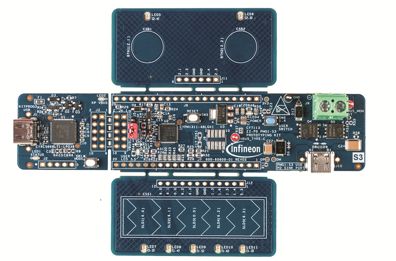

# PMG1-CY7113 BSP

## Overview

The CY7113 EZ-PD PMG1-S3 Prototyping Kit is a development platform to design products which can be powered from a high- voltage USB PD port, and also need a microcontroller with CAPSENSE™ capability to implement different applications.

To use code from the BSP, simply include a reference to `cybsp.h`.

## Features

### Kit Features:

* USB PD 3.0 compliant Sink which can support up to 100W (20V, 5A) of power consumption.
* Support for two self-capacitance based CAPSENSE™ buttons and one 5-segment slider.
* USB bus powered operation.
* KitProg3 based programming and debug interface.
* Access to the pins of PMG1-S3 silicon (CYPM1311-48LQXI) in hardware and support for BSP, HAL, PDL and Middleware in Modus Toolbox.

### Kit Contents:

* EZ-PD CYPM1311-48LQXI based board
* Quick Start Guide

## BSP Configuration

The BSP has a few hooks that allow its behavior to be configured. Some of these items are enabled by default while others must be explicitly enabled. Items enabled by default are specified in the PMG1-CY7113.mk file. The items that are enabled can be changed by creating a custom BSP or by editing the application makefile.

Components:
* Device specific category reference (e.g.: CAT1) - This component, enabled by default, pulls in any device specific code for this board.

Defines:
* CYBSP_WIFI_CAPABLE - This define, disabled by default, causes the BSP to initialize the interface to an onboard wireless chip if it has one.
* CY_USING_HAL - This define, enabled by default, specifies that the HAL is intended to be used by the application. This will cause the BSP to include the applicable header file and to initialize the system level drivers.
* CYBSP_CUSTOM_SYSCLK_PM_CALLBACK - This define, disabled by default, causes the BSP to skip registering its default SysClk Power Management callback, if any, and instead to invoke the application-defined function `cybsp_register_custom_sysclk_pm_callback` to register an application-specific callback.

### Clock Configuration

| Clock    | Source    | Output Frequency |
|----------|-----------|------------------|
| CLK_HF   | CLK_IMO   | 48 MHz           |

### Power Configuration

* System Idle Power Mode: Deep Sleep
* VDDA Voltage: 3300 mV
* VDDD Voltage: 3300 mV

See the [BSP Setttings][settings] for additional board specific configuration settings.

## API Reference Manual

The PMG1-CY7113 Board Support Package provides a set of APIs to configure, initialize and use the board resources.

See the [BSP API Reference Manual][api] for the complete list of the provided interfaces.

## More information
* [PMG1-CY7113 BSP API Reference Manual][api]
* [PMG1-CY7113 Documentation](http://www.cypress.com/CY7113)
* [Cypress Semiconductor, an Infineon Technologies Company](http://www.cypress.com)
* [Infineon GitHub](https://github.com/infineon)
* [ModusToolbox™](https://www.cypress.com/products/modustoolbox-software-environment)

[api]: https://infineon.github.io/TARGET_PMG1-CY7113/html/modules.html
[settings]: https://infineon.github.io/TARGET_PMG1-CY7113/html/md_bsp_settings.html

---
© Cypress Semiconductor Corporation (an Infineon company) or an affiliate of Cypress Semiconductor Corporation, 2019-2022.